#### Assignment 2:

# Recognition/Classification

Computer Vision

NTU, Spring 2026

Announced: 2026/03/27

Deadline: 2026/04/17

## Outline

Part 1: Bag-of-Words Scene Recognition

Part 2: CNN Image Classification

## Before you start…

- •Environment setup (see README.md)
  - **Python 3.8**
  - **Python 3.6**
- •Download the dataset
  - hw2\_data.zip

#### Part 1 :

Bag-of-Words Scene Recognition

## BoWScene Recognition

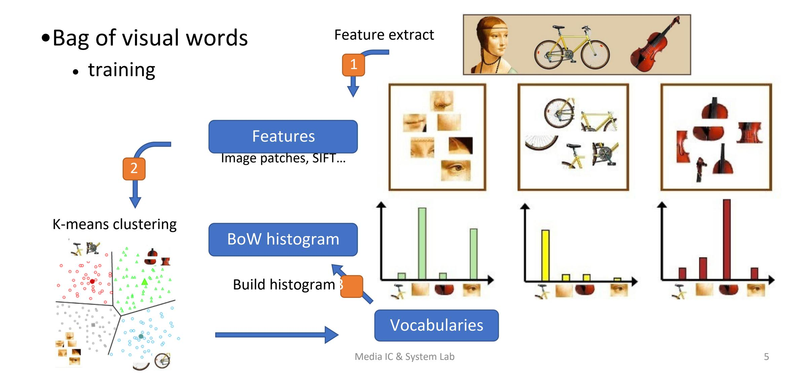

## BoWScene Recognition

•Bag of visual words

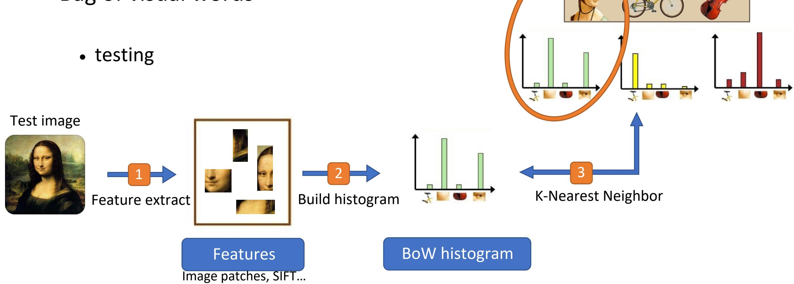

Media IC & System Lab 6

## BoWScene Recognition

- •You will have to implement two kinds of feature representations
  - 1. Tiny image
    - get\_tiny\_images() •
  - 2. Bag of SIFT (cyvlfeat.siftis allowed)
    - build\_vocabulary()
    - get\_bags\_of\_sifts()
- •Then apply hand-craft classifier
  - 1. K-NearestNeighbor(sklearn.neighbors.KNeighborsClassifier is NOT allowed)
    - nearest\_neighbor\_classify()

## Dataset

- hw2\_data/p1\_data/train
  - •100 grayscale images per category
- hw2\_data/p1\_data/test
  - •100+ grayscale images per category

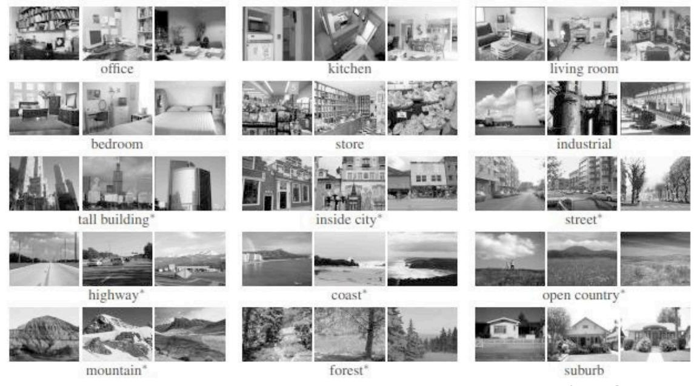

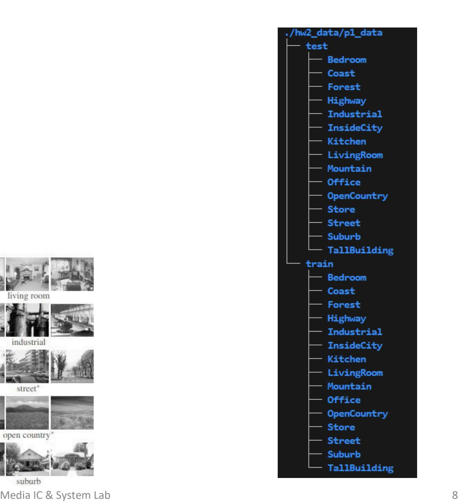

## Assignment Description

- p1/p1.py
  - Read data, feature extract, classification, compute accuracy, plot confusion matrix.
  - TAwill run this code to evaluate your result.
- p1/utils.py
  - get\_tiny\_images() ## TODO ##
    - Build tiny image features.
  - build\_vocabulary() ## TODO ##
    - Sample SIFT descriptors from training images, cluster the m with kmeans and return centroid.
  - get\_bags\_of\_sifts() ## TODO ##
    - Construct SIFT and build a histogram indicating how many times each centroid was used.
  - nearest\_neighbor\_classify() ## TODO ##
    - Predict the category for each test image.
    - CANNOT USE sklearn.neighbors.KNeighborsClassifier
- p1/p1\_run.sh
  - example for code execution.

#### Part 2 :

CNN Image Classification

## CNN Image Classification

•Image classification – predict a label for each image

• Input : RGBimage

• Output : classification label

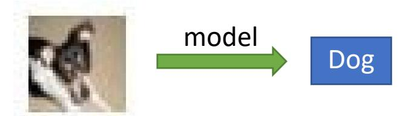

- •You need to perform image classification with the following methods:
  - A. Build and train a CNN model from scratch
    - torchvision.models, pretrained weights is NOT allowed.
  - •B. Try ResNet18 model
    - You can usetorchvision.models.resnet18(weights= "<pretrained-model>").
    - You may have to modify the structure to pass the strong baseline.

#### Dataset

- Original CIFAR-10 dataset (32x32 RGB images)
  - 50000 training images, 5000 each class
  - 10000 test images
- Provided dataset (You can only use this)
  - p2\_data/train
    - 20000 images, 1 annotation file (w/ labels)
  - p2\_data/val
    - 5000 images, 1 annotation file (w/ labels)
    - You cannot use the validation labels to train your model in a fully supervised manner.
  - p2\_data/unlabel
    - 30000 images, 1 annotation file (w/o labels)
    - For semi-supervised (optional)

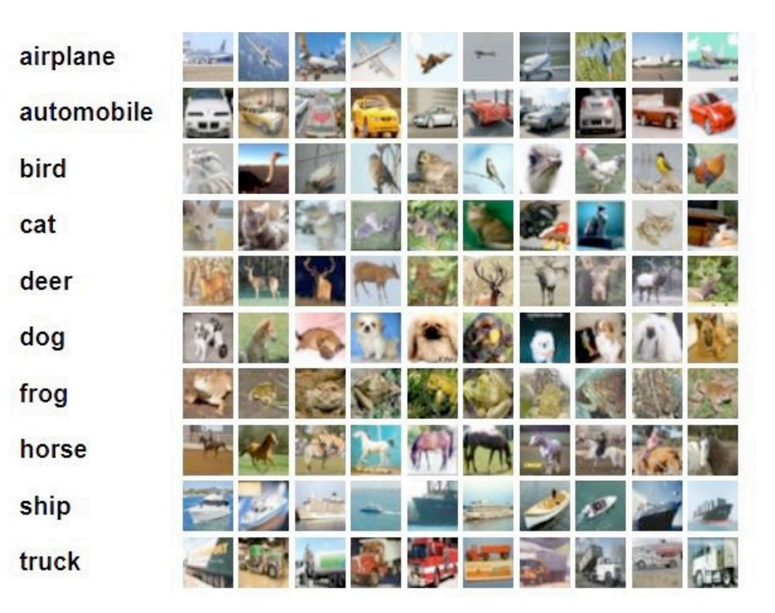

hw2\_data/p2\_data

train

val

unlabel

## Assignment Description

•p2/p2\_train.py ## TODO ##

• Start training,write log files, plot learning curves, etc.

- •p2/p2\_inference.py ## TODO ##
  - Inferencing, generate predicted output to csv file.
  - TA will run this code to generate your result.
- •p2/p2\_eval.py ## DO NOT MODIFY ##
  - Evaluate accuracy between predicted and ground truth labels.
  - TA will run this code to evaluate your result.

```
output csv file format
```

## Assignment Description

- p2/model.py ## TODO ##
  - Define your own models.
- p2/dataset.py ## TODO ##
  - Define your customized dataset.
- p2/config.py
  - Hyperparameters setting for training.
- p2/utils.py ## DO NOT MODIFY ##
  - Some helper functions.
- p2/p2\_run\_train.sh, p2\_run\_test.sh
  - example for code execution.

## Data Augmentation

•CNNs are not rotationally invariant! We can apply a serial of data augmentation on training images for a robust model.

- •You can simply apply a built-in function in pytorch
  - [•](https://pytorch.org/vision/stable/transforms.html) [https://pytorch.org](https://pytorch.org/vision/stable/transforms.html) [/vision/stable/transforms.html](https://pytorch.org/vision/stable/transforms.html)

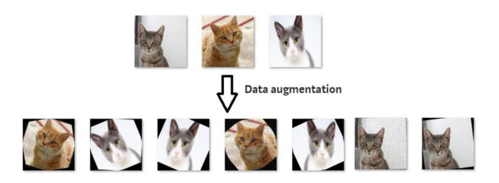

## Semi-supervised Learning (optional)

• Apply a well-trained model to verify if the images need to be preserved.

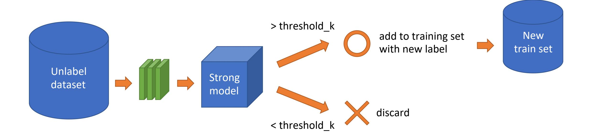

## Execution

- TAs will execute your code in the following manner, each of them must be finished in 10 mins
- Part 1.
  - python3 p1.py --feature < tiny\_image, bag\_of\_sift> --classifier <nearest\_neighbor> --dataset\_dir <path/to/hw2\_data/p1\_data>
- Part 2.
  - python3 p2\_inference.py --test\_datadir <path/to/hw2\_data/p2\_data> --model\_type<mynet, resnet18> --output\_path <path/to/prediction/csv/file>
  - python3 p2\_eval.py \$1 \$2 => this should reproduce the accuracy in your report.
    - --csv\_path <path/to/prediction/csv/file>
    - --annos\_path <path/to/annotation/file>

## Execution

- TAs will also execute your training script
- NO TIMEOUT LIMIT! Dont worry

## Performance (65%)

•Part 1 : 25%

|          | Tiny Image (10%) |       |
|----------|------------------|-------|
|          | Accuracy         | Grade |
| baseline | 0.2              | 10%   |

|                 | Bag of SIFT (15%) |       |
|-----------------|-------------------|-------|
|                 | Accuracy          | Grade |
| strong baseline | 0.6               | 15%   |
| simple baseline | 0.55              | 10%   |

#### •Part 2 : 40% (The better result of your two models will be used here)

|                    | Public Validation Set (20%) |          |
|--------------------|-----------------------------|----------|
|                    | Grade                       | Accuracy |
| strong baseline    | 20%                         | 0.88     |
| medium<br>baseline | 15%                         | 0.85     |
| simple baseline    | 10%                         | 0.75     |

|                    | Private Test Set (20%) |       |
|--------------------|------------------------|-------|
|                    | Accuracy               | Grade |
| strong baseline    | 0.88                   | 20%   |
| medium<br>baseline | 0.85                   | 15%   |
| simple baseline    | 0.75                   | 10%   |

## Report (35%)

- Follow the template we provide and submit **pdf** file
- Part 1 : BoWScene Recognition (10%)
  - (5%) Plot confusion matrix of two settings.
  - (5%) Compare the results / accuracy of both settings and explain the result.

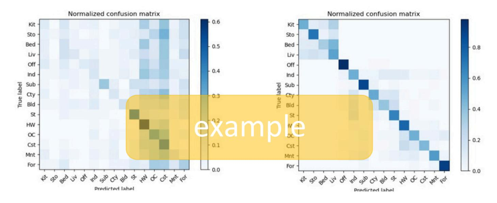

## Report (35%)

- •Part 2 : CNN Image Classification (25%)
  - •(2%) Report accuracyof both models (bothA & B) on the validation (public) set.
  - •(5%) Print the network architectures & number of parameters of both models. What is the main difference between ResNetand other CNN architectures?
  - •(8%) Plot four learning curves (loss & accuracy) of the training process (train/validation) for both models. Total 8 plots.
  - •(10%) Briefly describe what method do you apply on your best model? (e.g. data augmentation, model architecture, loss function, etc)

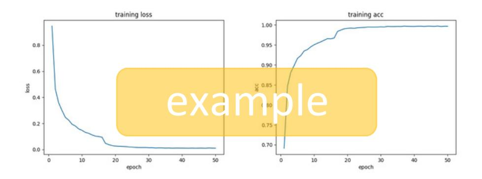

## Submission

- Deadline: 2026/04/17
- We would run in your code in both environment
- R12345678\_hw2/

```
p1/
    p1.py, utils.py vocab.pkl, test_image_feats.pkl,
    train_image_feats.pkl
p2/
    p2_train.py, p2_inference.py
    config.py, model.py, dataset.py
    download.sh (optional)
    p2_run_train.sh
    checkpoint/
        mynet_best.pth, resnet18_best.pth
```

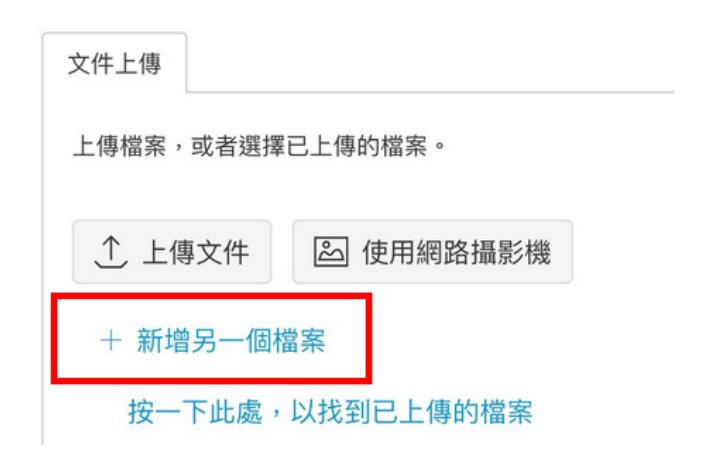

•Submit **report.pdf** & **StudentID\_hw2.zip**(e.g. R01234567\_hw2.zip) to NTU COOL IMPORTANT: There must be a directory named StudentID\_hw2/ after unzipped

## Submission

- DO NOT upload the dataset
- Late policy (refer to hw1)
- Do not delete your trained model before the TAs disclose your homework score and before you make sure that your score is correct.
- Plagiarism is forbidden!

## Submission

- For part2,
  - For each model, the size should be less than 80MB.
  - If you cannot match the validation accuracy in your report…
    - TA will send you an e-mail to run another chance only for one time.
  - If your models are too large to submit on NTU COOL, **provide download.sh** under p2/ to download them from cloud drive (Dropbox, Google Drive…) to checkpoint/ (use **-O** argument)
    - TA will run `bash download.sh` first if this script exists.
    - You can use **wget**, **gdown**, **unzip**, etc. command.
    - Remember to set permission to **public**.

## Packages

• You should follow README.md to install environment.

- **Python==3.8.20**
  - cyvlfeat=0.7.1
  - torch==2.2.1
  - torchvision==0.17.1
  - torchaudio==2.2.1
  - matplotlib==3.7.5
  - numpy==1.24.0
  - Pillow==10.4.0
  - scikit-learn==1.3.2
  - scipy==1.8.1
  - tqdm==4.67.1
  - gdown==5.2.0

- **Python==3.6.13**
  - cyvlfeat=0.7.0
  - torch==1.10.1
  - torchaudio==0.10.1
  - torchvision==0.11.2
  - matplotlib==3.3.4
  - numpy==1.19.5
  - Pillow==8.4.0
  - scikit-learn==0.24.2
  - scipy==1.5.4
  - tqdm==4.64.1
  - gdown==4.6.4

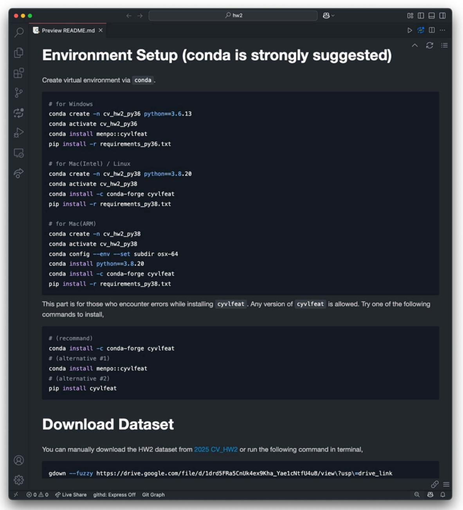

## If You Still Have Problems…

- 1.1.Use NTU COOL (strongly recommended)
- 2.TA will answer the questions ASAP and record some common problems you may face.
- 3.Google

## TA Information

- Yu-Ching (范宇清)
  - E-mail: [jackmafan@media.ee.ntu.edu.tw](mailto:jackmafan@media.ee.ntu.edu.tw)
  - Location: 博理421
- Yi-Fan Chen(陳奕帆)
  - E-mail: [piguheren@media.ee.ntu.edu.tw](mailto:piguheren@media.ee.ntu.edu.tw)
  - Location: 博理421

#### Supplementary

## Tips for Achieving the Baselines

#### In Part 1.

- Consider different metrics to evaluate the distance between features
- [Re](https://docs.scipy.org/doc/scipy/reference/generated/scipy.spatial.distance.cdist.html)f[:scipy.spatial.distance.cdist--SciPy Manual](https://docs.scipy.org/doc/scipy/reference/generated/scipy.spatial.distance.cdist.html)

#### In Part 2.

Inaddition to data augmentation and semi-supervised techniques, you can consider modifying ResNet18 architecture since the first convolution layer's kernel size of ResNet18 is 7x7 which is relatively large to 32x32 images and may loss some information.