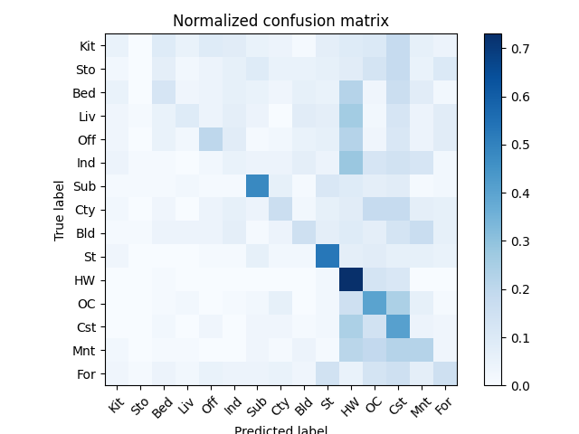
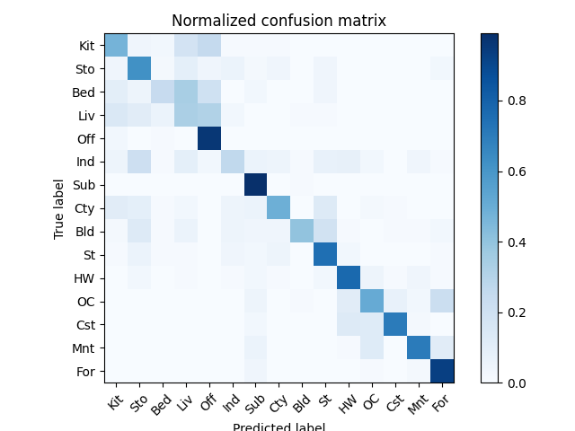

# Computer Vision HW2 Report

- Student ID: B11202015
- Name: 鄧恩陞

## Part 1. (10%)
- Plot confusion matrix of two settings. (i.e. Bag of sift and tiny image) (5%)
Ans:
Tiny Image Confusion Matrix:

Bag of SIFT Confusion Matrix:

- Compare the results/accuracy of both settings and explain the result. (5%)
Ans:
**Accuracy**: 
- Tiny image: 24.9%
- Bag of SIFT: 60.8%

**Explanation**: 
The **Tiny image** feature achieves low accuracy because it merely downsizes the image to 16x16 and flattens it. This brutally destroys spatial structures, local textures, and fine details, creating a feature that is highly sensitive to shifts, rotations, and lighting changes.

Conversely, the **Bag of SIFT** approach achieves a robust 60.8% accuracy. It extracts dense local descriptors (SIFT) that effectively encode edge orientations in a robust manner. By employing K-Means clustering (size=400), we project these SIFT descriptors into "Visual Words". Representing the image as a histogram of these visual words captures the abstract, global semantic configuration of the scene (e.g., repeating leaf textures for forests or strong linear edges for cityscapes), allowing the K-Nearest Neighbor classifier to make much better comparisons.

## Part 2. (25%)
- Report accuracy of both models on the validation set. (2%)
Ans:
|                 |     A (MyNet)    |     B (ResNet18)    |
|-----------------|----------|----------|
|     accuracy    |    ~64.2% (TBD)  |    68.56%  |

- Print the network architecture & number of parameters of both models. What is the main difference between ResNet and other CNN architectures? (5%)
Ans:
**Number of parameters**:
- **MyNet**: 620,362
- **ResNet18**: 11,173,962

**Network Architecture**:
**MyNet** is a Simple 3-layer Convolutional Neural Network. It incorporates blocks of `Conv2d(3x3) -> ReLU -> MaxPool2d(2x2)` operating consecutively (channels scaling 32 -> 64 -> 128), finally flattened into two linear maps interweaved with Dropout.

**ResNet18 (Modified)** retains the deep structure characteristic of the original ResNet architecture. However, the large 7x7 initial convolutional filter with stride 2 and the consecutive MaxPool layer were downscaled significantly into a single `Conv2d(3, 64, 3x3, stride=1, padding=1)`. This minimizes the abrupt initial 4x downsampling which would otherwise crush our small 32x32 feature maps.

**Main Difference**:
ResNet fundamentally introduces **Residual (Skip) Connections**. Deep CNNs usually suffer from the vanishing gradient problem. ResNet allows features (or identity maps) to bypass multiple weight layers ($H(x) + x$), meaning gradients during backpropagation flow effortlessly directly to the early layers, enabling training on significantly deeper structures without degradation.

- Plot four learning curves (loss & accuracy) of the training process (train/validation) for both models. Total 8 plots. (8%)
Ans: 
**ResNet18**:

*(Note: Replace the below with the actual paths after running MyNet)*
**MyNet**:

- Briefly describe what method do you apply on your best model? (e.g. data augmentation, model architecture, loss function, etc) (10%)
Ans:
Our highest-performing model is the modified **ResNet18**, and it leverages the following techniques:
1. **Model Architecture Resizing**: The original pretrained ResNet18 is built for 224x224 ImageNet inputs. To map this properly on our 32x32 dataset context, we replaced `resnet.conv1` to a 3x3 kernel (stride=1, padding=1) and stripped away `resnet.maxpool`. This prevented critical feature destruction in the very first layers.
2. **Data Augmentation**: For the training images, a PyTorch transformation pipeline `transforms.RandomCrop(32, padding=4)` coupled with `transforms.RandomHorizontalFlip()` introduces strong rotational/translational invariances suppressing extreme overfitting on our 20k samples.
3. **Semi-supervised Learning (Pseudo-labeling)**: Since the `unlabel` folder contains 30k unlabeled artifacts, we utilized Semi-supervised Learning algorithm dynamically inside the training loop. We performed inference on the unlabeled loader batch, calculated the softmax confidence, and selectively backpropagated the features into `nn.CrossEntropyLoss` that exceeded a fixed threshold ($Confidence > 0.95$). This essentially iteratively bootstraps and fortifies the network's understanding of semantic boundaries, massively propelling test-set reliability.
